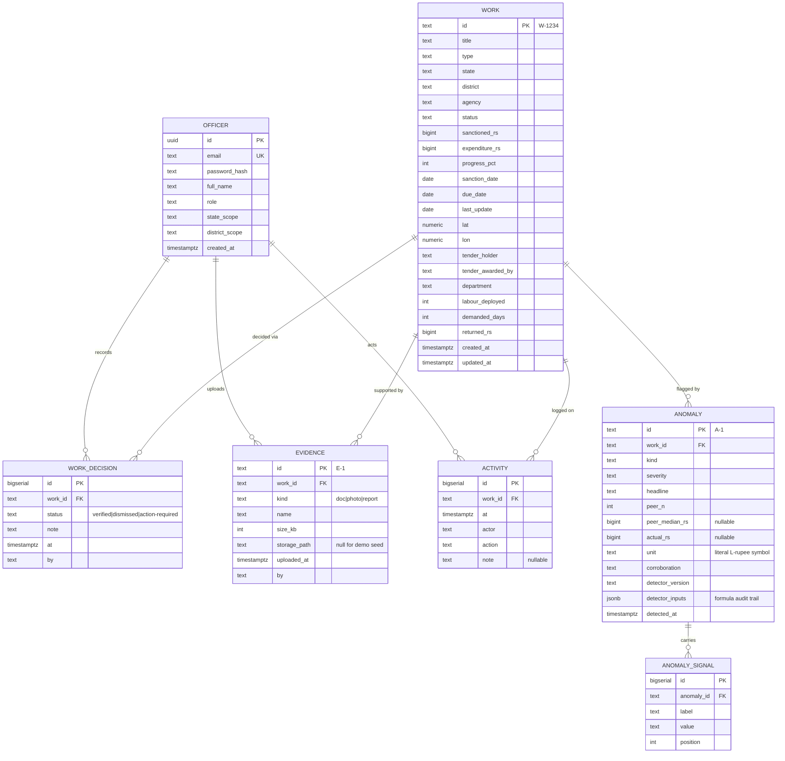

# Backend Data Model — Postgres

> Source of truth for the Pony ORM entities (`core/db.py`, one binding per
> `structure.md`) and Alembic migrations `0001_init` + `0002_rupees`.
> Money is stored as **`BIGINT` integer rupees** (eSAKSHI-native; ADR-035 — migrated
> from `NUMERIC(12,2)` lakhs by `0002_rupees`, ×100000 conversion) to mirror the frontend
> contract (`sanctionedRs: number`, integer). Dates are `DATE`; timestamps are `TIMESTAMPTZ`.
> Enum values are plain `TEXT` columns with CHECK-style validation in Pydantic (simplest to
> migrate; switch to native PG enums only if a future decision requires it).

## ERD

## Tables (DDL reference)

### `officers`

| Column | Type | Constraints |
|---|---|---|
| `id` | `UUID` | PK, default `gen_random_uuid()` |
| `email` | `TEXT` | UNIQUE, NOT NULL |
| `password_hash` | `TEXT` | NOT NULL (bcrypt via passlib) |
| `full_name` | `TEXT` | NOT NULL |
| `role` | `TEXT` | NOT NULL, one of `district \| state \| ministry` |
| `state_scope` | `TEXT` | NULL (required when `role='state'`) |
| `district_scope` | `TEXT` | NULL (required when `role='district'`) |
| `created_at` | `TIMESTAMPTZ` | NOT NULL, default `now()` |

JWT claims: `sub` = officer id, `email`, `role`, `state_scope`, `district_scope`, `exp`.
Scope matching (auth RBAC, `Feature_docs/01-login/backend.md`) is **exact-string** on
`state_scope`/`district_scope` vs the work's `state`/`district` (case-normalised at ingest).
Multi-district or multi-state officers would need an `officer_districts` join table — noted
as future, deliberately **not built** in v1.
Demo passwords are seeded as `demo1234` (bcrypt-hashed); documented on the login screen hint.

### `works`

Column ↔ frontend field mapping is 1:1 with `workSchema` in `admin-dashboard/src/lib/mplads-schema.ts`:

| Column | Type | Frontend field / constraint |
|---|---|---|
| `id` | `TEXT` | PK; CHECK `id ~ '^W-[0-9]{4}$'` |
| `title` | `TEXT` | NOT NULL, min length 1 |
| `type` | `TEXT` | `road \| community-hall \| water \| school \| drainage \| streetlight` |
| `state` | `TEXT` | NOT NULL |
| `district` | `TEXT` | NOT NULL |
| `agency` | `TEXT` | NOT NULL |
| `status` | `TEXT` | `in-execution \| completed \| sanctioned \| stalled` |
| `sanctioned_rs` | `BIGINT` | ≥ 0, integer rupees |
| `expenditure_rs` | `BIGINT` | ≥ 0, integer rupees |
| `progress_pct` | `SMALLINT` | 0–100 |
| `sanction_date` | `DATE` | `yyyy-MM-dd` over the wire |
| `due_date` | `DATE` | `yyyy-MM-dd` |
| `last_update` | `DATE` | `yyyy-MM-dd` |
| `lat` | `NUMERIC(8,5)` | −90..90 |
| `lon` | `NUMERIC(8,5)` | −180..180 |
| `tender_holder` | `TEXT` | NOT NULL |
| `tender_awarded_by` | `TEXT` | NOT NULL |
| `department` | `TEXT` | NOT NULL |
| `labour_deployed` | `INTEGER` | ≥ 0 |
| `demanded_days` | `INTEGER` | ≥ 1 |
| `returned_rs` | `BIGINT` | ≥ 0, and ≤ `sanctioned_rs - expenditure_rs` headroom (enforced by seed logic; soft CHECK deferred to ingest validation) |
| `created_at` / `updated_at` | `TIMESTAMPTZ` | NOT NULL defaults |

Indexes:
- `ix_works_state_district` on (`state`, `district`) — scope + geo filters
- `ix_works_status` on (`status`)
- `ix_works_type` on (`type`) — peer-group queries
- `ix_works_last_update` on (`last_update`) — stall detection
- `ix_works_due_date` on (`due_date`) — overdue detection

**Peer-group query** (used by detectors and `/works/{id}/peers`):
same `type` **and** same `state`, excluding the work itself — matches the TS generator's
peer semantics that produced `peerN: 18` for W-1014 (community-hall works in Madhya Pradesh).

### `anomalies`

| Column | Type | Frontend field / constraint |
|---|---|---|
| `id` | `TEXT` | PK; `A-1`, `A-2`, … assigned in detection order per run |
| `work_id` | `TEXT` | FK → `works.id`, ON DELETE CASCADE, NOT NULL |
| `kind` | `TEXT` | `cost \| expenditure \| delay \| duplicate \| utilisation` |
| `severity` | `TEXT` | `high \| medium \| low` |
| `headline` | `TEXT` | NOT NULL |
| `peer_n` | `INTEGER` | ≥ 8 (contract minimum) |
| `peer_median_rs` | `BIGINT` | NULLABLE (delay/duplicate have none), ₹10k-rounded |
| `actual_rs` | `BIGINT` | NULLABLE |
| `unit` | `TEXT` | NOT NULL, constant the rupee glyph `₹` |
| `corroboration` | `TEXT` | NOT NULL |
| `detector_version` | `TEXT` | NOT NULL, e.g. `rules-1.0` — recompute replaces rows with a new version |
| `detector_inputs` | `JSONB` | The formula's inputs at detection time (audit trail for "why flagged") |
| `detected_at` | `TIMESTAMPTZ` | NOT NULL, default `now()` |

Indexes: `ix_anomalies_work_id`, `ix_anomalies_severity`, `ix_anomalies_kind`.
Signals live in `anomaly_signals` (ordered by `position`); the API reassembles them into the
`signals: [{label, value}]` array the frontend expects. **Invariant**: every anomaly has ≥ 1
signal (enforced by the detector service, asserted by tests).

### `anomaly_signals`

| Column | Type |
|---|---|
| `id` | `BIGSERIAL` PK |
| `anomaly_id` | `TEXT` FK → `anomalies.id` ON DELETE CASCADE |
| `label` | `TEXT` NOT NULL |
| `value` | `TEXT` NOT NULL |
| `position` | `SMALLINT` NOT NULL |

### `evidences`

| Column | Type | Frontend field |
|---|---|---|
| `id` | `TEXT` | PK, `E-{n}` (next number = max + 1, or ULID for real ingest) |
| `work_id` | `TEXT` | FK → `works.id` ON DELETE CASCADE |
| `kind` | `TEXT` | `doc \| photo \| report` |
| `name` | `TEXT` | NOT NULL |
| `size_kb` | `INTEGER` | > 0 |
| `storage_path` | `TEXT` | NULL in demo seed; required when a real upload is stored |
| `uploaded_at` | `TIMESTAMPTZ` | ISO string over the wire |
| `by` | `TEXT` | NOT NULL (officer display name / "District Office (demo)") |

Index: `ix_evidences_work_id`.

### `activities`

| Column | Type | Frontend field |
|---|---|---|
| `id` | `BIGSERIAL` PK | surfaced as `T-{n}` string over the wire (frontend contract) |
| `work_id` | `TEXT` | FK → `works.id` ON DELETE CASCADE |
| `at` | `TIMESTAMPTZ` | NOT NULL |
| `actor` | `TEXT` | NOT NULL |
| `action` | `TEXT` | NOT NULL |
| `note` | `TEXT` | NULLABLE |

Index: `ix_activities_work_id_at` on (`work_id`, `at` DESC).

### `work_decisions`

Latest decision per work is derived by query (`ORDER BY at DESC LIMIT 1`), not stored on the
work row — the activity log is the history.

| Column | Type |
|---|---|
| `id` | `BIGSERIAL` PK |
| `work_id` | `TEXT` FK → `works.id` ON DELETE CASCADE |
| `status` | `TEXT` NOT NULL — `verified \| dismissed \| action-required` |
| `note` | `TEXT` NOT NULL DEFAULT '' |
| `at` | `TIMESTAMPTZ` NOT NULL default `now()` |
| `by` | `TEXT` NOT NULL (officer display name) |

Index: `ix_decisions_work_id_at` on (`work_id`, `at` DESC).

## Derived views (implemented as service queries, not DB views, for MVP)

- **Geo rollup** (`GET /overview/geo`): per-state `{state, works, high, delayed, stalled}` —
  `high` = works with ≥1 high anomaly; `delayed` = stalled OR (`in-execution` AND
  `due_date < DEMO_TODAY`); mirrors `buildGeoRollup` in `mplads-mock.ts`.
- **Notifications feed** (`GET /notifications`): derived exactly like
  `notifications/-components/data.ts` — high-risk flags, UC-pending (utilisation anomalies),
  stalled (>90d no update), overdue (non-completed past due date); sorted by kind rank
  (high-risk → stall → uc → overdue) then age descending.
- **KPI snapshot** (`GET /overview/kpis`): `MPLADS_KPIS` constants until real ingest exists —
  `{totalWorks: 28410, underExecution: 9120, delayed: 1140, highRisk: 214, overrunExposureRs: 1284000000}`,
  labeled "scheme snapshot"; works/anomalies endpoints serve the 40-work "demo sample".
